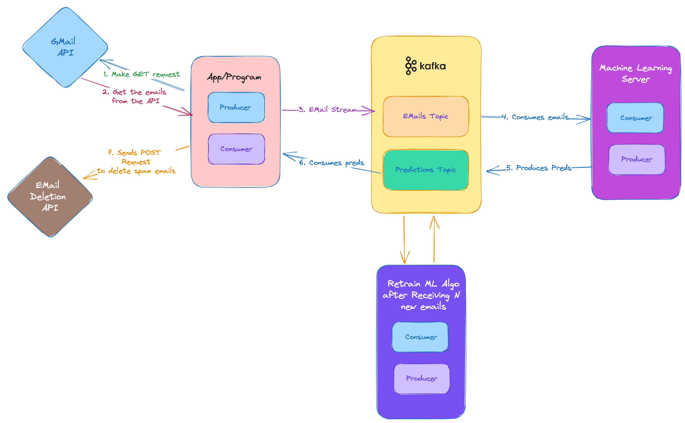

# Real-Time Email Spam Detection

I am pretty sure that I won't be able to complete this project as I literally know nothing about Kafka, I'll be learning while working on this project and trying to complete it. I will be using the Gmail API that ingests new emails and sends them to Kafka as streams for processing and inference, if the email is classified as spam it would be deleted.

## UPDATE

COMPLETED THE PROJECT!! I didn't expect I would be able to even come close to building this project, I even dockerized the entire app so anyone can use it. The architecture is the same as the figure below.

TODO:
- [ ] Model retraining after getting new data
- [ ] Figure out a way to mark ham emails as unread w/o going in an infinte loop
- [ ] Fix the 3 docker container setup(NOT IMPORTANT)

## DEMO
A demo of the complete working project can be found [here using docker](https://drive.google.com/file/d/1VyFT3uT3pHVL-WEEWdlaB_t1SOz4f1Yy/view?usp=sharing) or [here without using docker.](https://drive.google.com/file/d/1LL_tAkL4hE6ELuHDxyBQ6T3-nxhxU__S/view?usp=sharing)

## The Pipeline

This is the system architecture that I will be following for this project. I'm pretty sure it will change as I learn more about Kafka and how to use it.

## Steps to get the Gmail OAuth Credentials to get API access
1. Go to [Google Cloud Console](https://console.cloud.google.com/) and create a test project.
2. Go to the [API Library](https://console.cloud.google.com/apis/library) and enable the Gmail API.
3. Go to the [Credentials](https://console.cloud.google.com/apis/credentials) page and create a new OAuth Client ID. While going through these steps enable all api access to the app.
4. Download the credentials as a JSON file and rename it to `credentials.json`.
5. Copy the `credentials.json` file to the root directory.
6. Download the trained weights from [here](https://www.kaggle.com/datasets/aryankhatana/bert-based-cased-email-spam-classifier) and copy the `best_model_state.bin` file to the root directory.

## Run the app
- Steps to run the app using Docker
    1. Run `python3 create_token.py` to get the `token.json` file in the correct modules.
    2. Run `docker compose build` to build the docker image.
    3. Run `docker compose up -d` to run all the services in the app.

- Steps to run the app natively (w/o Docker)
    1. Run `python3 create_token.py` to get the `token.json` file in the correct modules.
    2. Open 3 terminal sessions and `cd` into `ingestion`, `computation`, `delete_spam` in each of them.
    3. Comment out everything in the `docker-compose.yml` except zookeeper, kafka and the network.
    4. Run `docker compose up -d` to run zookeeper and kafka.
    5. in the `config.py` file in the root directory change the `KAFKA_BROKER` to `localhost:29092`.
    6. Run `python3 produce.py` in the first `ingestion` session.
    6. Run `python3 consume.py` in the first `computation` session.
    6. Run `python3 delete_spam.py` in the first `delete_spam` session.